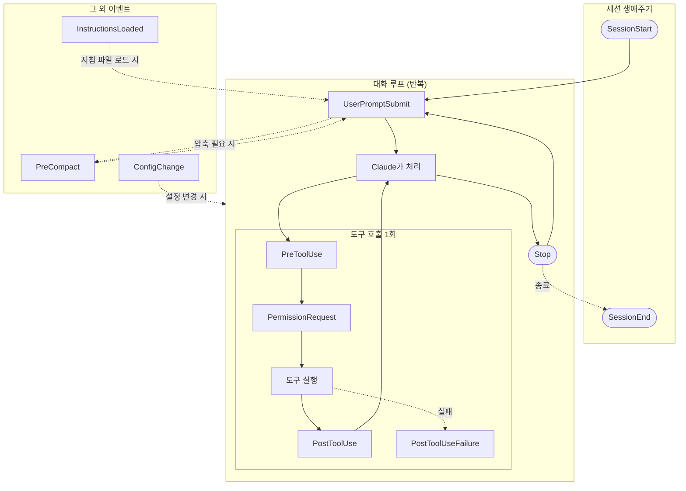

# claude-rails

에이전트(Claude Code)를 사용하기 위해 개인적으로 만들어 사용하고 있는 훅 모음집입니다.
Claude Code와 함께 작업할 때, Claude가 제가 의도한 대로 행동할 수 있도록 돕기 위해
만들었습니다.

## 왜 필요했는지 말씀드립니다

CLAUDE.md에 "이렇게 해주세요"라고 적어두는 약속만으로는 매번 지켜지기가 쉽지
않습니다. 프롬프트 인젝션이나 컨텍스트 압축처럼, 의도와 다르게 흘러갈 수 있는
지점들이 있기 때문입니다. 그래서 기계적으로 검증할 수 있는 규칙은 훅(코드)으로
물리적으로 강제하도록 하였고, 결국 사람의 판단이 필요한 두 지점(백로그 승인, push
전 코드 리뷰)만은 정직하게 사람에게 맡겨두었습니다. 정해진 규칙을 벗어나는 순간
해당 액션 자체가 실행되지 않도록 만든 것이 이 저장소의 핵심이라고 말씀드릴 수
있습니다.

## 무엇을 만들었는지 말씀드립니다

Claude Code의 [hooks](https://code.claude.com/docs/ko/hooks) 이벤트마다 동작하는
28개의 스크립트를 만들었습니다.
[Backlog.md](https://github.com/MrLesk/Backlog.md)(Git 저장소 안에 마크다운 파일로
태스크·문서·의사결정을 관리하는 CLI 기반 프로젝트 관리 도구입니다) 워크플로 전용
5개와, 프로젝트 종류와 무관하게 항상 켜져 있는 범용 안전/관측 훅 23개로 이루어져
있습니다. 모든 훅은 개인 fork 안에서만 강하게 적용되며, 운영 레포로 올리는 PR은
항상 사람이 직접 열도록 하였습니다.

## 주요 특징을 소개해 드립니다

- **기계적 강제와 사람의 판단을 명확히 나누었습니다** — 검증 가능한 부분은 훅으로
  막고, 백로그 승인과 push 전 코드 리뷰 두 곳만 사람에게 맡겨두었습니다.
- **완전히 독립적으로 만들었습니다** — 훅끼리 서로 import하지 않아, 코드 중복은
  있지만 한 훅의 버그가 다른 훅에 영향을 주지 않도록 하였습니다.
- **Python으로 작성하였습니다** — 원래 여러 개는 bash 스크립트였으나, 셸보다
  가독성이 낫고 작성자가 Python 생태계에 더 익숙하다는 실용적인 이유로 Python으로
  옮겼습니다. 여러 대안을 검토하기는 하였으나, 정답이 하나만 있는 문제는 아니었다고
  생각합니다.

## 훅을 생애주기별로 정리해 드립니다

Claude Code의 훅은 [공식 문서](https://code.claude.com/docs/ko/hooks)에 정의된
특정 이벤트(생애주기 단계)에 등록되어, 그 시점에만 실행됩니다. 전체 흐름을 먼저
그림으로 보여드린 뒤, 이 저장소에 있는 28개의 훅이 각각 어느 단계에서 동작하는지
표로 정리해 드리겠습니다.



이 저장소의 훅은 이 흐름 중 필요한 지점마다 걸려 있습니다 — 예를 들어
`require_active_task.py`는 `PreToolUse`(Edit\|Write)에, `block_stop_if_dirty.py`는
`Stop`에 걸려서 각각 해당 시점의 행동을 검증합니다. 아래 표는 28개 훅 전체가 정확히
어느 단계에 걸려 있는지 나열한 것입니다. 훅 이름을 누르시면 실제 소스 파일로
이동합니다.

| 생애주기                            | 훅                                                                 | 범위       | 하는 일                           |
| ----------------------------------- | ------------------------------------------------------------------ | ---------- | --------------------------------- |
| SessionStart                        | [`session_start.py`](hooks/session_start.py)                       | 🔒 backlog | 워크플로 가이드/무결성 이슈 주입  |
| SessionStart                        | [`session_logger.py`](hooks/session_logger.py)                     | 범용       | 세션 시작 로그                    |
| SessionStart                        | [`dead_rules_audit.py`](hooks/dead_rules_audit.py)                 | 범용       | 규칙 준수 스코어카드 시작         |
| SessionStart                        | [`standup_autopilot.py`](hooks/standup_autopilot.py)               | 범용       | 전날 미해결 항목 재주입           |
| SessionStart                        | [`bounty_board.py`](hooks/bounty_board.py)                         | 범용       | TODO/FIXME 부채 현황 표시         |
| UserPromptSubmit                    | [`instructions_audit.py`](hooks/instructions_audit.py)             | 범용       | 적대적 지시 탐지 시 프롬프트 차단 |
| UserPromptSubmit                    | [`session_logger.py`](hooks/session_logger.py)                     | 범용       | 프롬프트 로그                     |
| UserPromptSubmit                    | [`dead_end_registry.py`](hooks/dead_end_registry.py)               | 범용       | 되돌림 패턴 감지                  |
| PreToolUse: Edit\|Write             | [`require_active_task.py`](hooks/require_active_task.py)           | 🔒 backlog | In Progress 태스크 없으면 차단    |
| PreToolUse: Edit\|Write             | [`dead_end_registry.py`](hooks/dead_end_registry.py)               | 범용       | 죽은 접근 재시도 경고             |
| PreToolUse: Bash(git *)             | [`pre_commit_check.py`](hooks/pre_commit_check.py)                 | 🔒 backlog | 브랜치/테스트 확인 후 커밋 허용   |
| PreToolUse: Bash(git *)             | [`dedup_drift_guard.py`](hooks/dedup_drift_guard.py)               | 범용       | 복붙 함수 drift 시 커밋 차단      |
| PreToolUse: Bash(git *)             | [`pre_push_check.py`](hooks/pre_push_check.py)                     | 🔒 backlog | Done+summary 확인 후 push 허용    |
| PreToolUse: Bash(git *)             | [`pre_push_coverage_check.py`](hooks/pre_push_coverage_check.py)   | 범용       | 커버리지 확인                     |
| PreToolUse: Bash(git *)             | [`pre_git_safety_check.py`](hooks/pre_git_safety_check.py)         | 범용       | main 직접 push/파괴적 gh 차단     |
| PreToolUse: Bash                    | [`block_dangerous_commands.py`](hooks/block_dangerous_commands.py) | 범용       | 위험 명령 차단                    |
| PreToolUse: Bash                    | [`case_insensitive_guard.py`](hooks/case_insensitive_guard.py)     | 범용       | 대소문자 경로 삭제 오발사 방지    |
| PreToolUse: Bash(gh pr create*)     | [`pr_provenance_stamp.py`](hooks/pr_provenance_stamp.py)           | 범용       | PR 본문에 provenance 삽입         |
| PreToolUse: Read\|Edit\|Write\|Bash | [`protect_secrets.py`](hooks/protect_secrets.py)                   | 범용       | 시크릿 파일 보호                  |
| PreToolUse: Bash\|Edit\|Write       | [`protect_tests.py`](hooks/protect_tests.py)                       | 범용       | 가짜 그린 방지                    |
| PreToolUse: Bash\|Edit\|Write       | [`config_guard.py`](hooks/config_guard.py)                         | 범용       | 자기 설정 변조 차단               |
| PreToolUse: 전체                    | [`instructions_audit.py`](hooks/instructions_audit.py)             | 범용       | 락 파일 있으면 전체 차단          |
| PostToolUse: 전체                   | [`session_logger.py`](hooks/session_logger.py)                     | 범용       | 도구 결과 로그                    |
| PostToolUse: 전체                   | [`nerf_receipts.py`](hooks/nerf_receipts.py)                       | 범용       | 실패율/토큰 사용량 기록           |
| PostToolUse: Edit\|Write            | [`auto_stage.py`](hooks/auto_stage.py)                             | 범용       | 자동 git add                      |
| PostToolUse: Edit\|Write            | [`format_code.py`](hooks/format_code.py)                           | 범용       | 포매터/린트 실행                  |
| PostToolUse: Edit\|Write            | [`dead_rules_audit.py`](hooks/dead_rules_audit.py)                 | 범용       | 규칙 준수 집계 갱신               |
| PostToolUse: Edit\|Write            | [`bounty_board.py`](hooks/bounty_board.py)                         | 범용       | TODO/FIXME XP 지급                |
| PostToolUse: Read\|Grep\|Glob\|Bash | [`context_hogs.py`](hooks/context_hogs.py)                         | 범용       | 컨텍스트 소비 리더보드            |
| PostToolUseFailure                  | [`nerf_receipts.py`](hooks/nerf_receipts.py)                       | 범용       | 실패 로그                         |
| Stop                                | [`block_stop_if_dirty.py`](hooks/block_stop_if_dirty.py)           | 🔒 backlog | dirty면 턴 종료 차단              |
| Stop                                | [`nerf_receipts.py`](hooks/nerf_receipts.py)                       | 범용       | Stop 로그                         |
| Stop                                | [`standup_autopilot.py`](hooks/standup_autopilot.py)               | 범용       | 스탠드업 파일 갱신                |
| SessionEnd                          | [`session_logger.py`](hooks/session_logger.py)                     | 범용       | 세션 종료 로그                    |
| SessionEnd                          | [`dead_rules_audit.py`](hooks/dead_rules_audit.py)                 | 범용       | 규칙 준수 집계 마무리             |
| SessionEnd                          | [`standup_autopilot.py`](hooks/standup_autopilot.py)               | 범용       | 스탠드업 파일 마무리              |
| ConfigChange                        | [`config_watch.py`](hooks/config_watch.py)                         | 범용       | 아웃오브밴드 설정 변경 감지       |
| PreCompact                          | [`pre_compact_backup.py`](hooks/pre_compact_backup.py)             | 범용       | 압축 전 transcript 백업           |
| PermissionRequest                   | [`permission_auto_allow.py`](hooks/permission_auto_allow.py)       | 범용       | 안전한 요청 자동 승인             |
| InstructionsLoaded                  | [`instructions_audit.py`](hooks/instructions_audit.py)             | 범용       | 로드 시점 적대적 지시 스캔        |

같은 훅이 여러 이벤트에 등록된 경우(예: `session_logger.py`, `nerf_receipts.py`,
`instructions_audit.py`)에는 행마다 반복하여 표기해 드렸습니다. 실제
`settings.hooks.json`에 등록된 내용과 1:1로 대응시켜 드리기 위함입니다.

## 설치 방법을 안내해 드립니다

```bash
cd ~/githubs/claude-rails && ./install.sh
```

## 더 자세한 내용이 궁금하시다면

- **전체 스펙**(Phase 명세, HITL 표, 설치/삭제, 파일 구성)은 `backlog doc view doc-2`
  에서 확인하실 수 있습니다.
- **세션 회고와 태스크별 상세 기록**은 `backlog doc list`에서 확인하실 수 있습니다.
- **핵심 의사결정**은 `backlog decision list`에서 확인하실 수 있습니다.
- **알려진 한계와 다음 단계 후보**는 `backlog draft list`에서 확인하실 수 있습니다.
